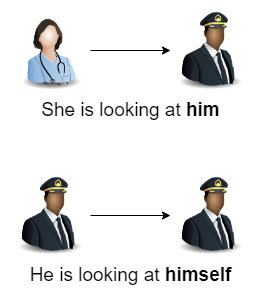
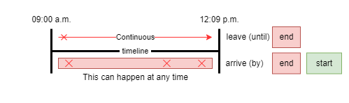
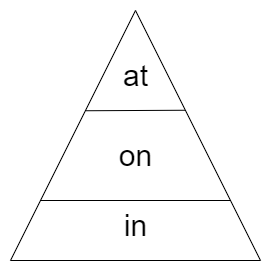

# Grammar <!-- omit in toc -->

## Contents <!-- omit in toc -->

- [1. Verb To Be](#1-verb-to-be)
  - [1.1. Present](#11-present)
    - [1.1.1. Affirmative form](#111-affirmative-form)
    - [1.1.2. Contractions form](#112-contractions-form)
    - [1.1.3. Negative form](#113-negative-form)
      - [1.1.3.1. Contractions with negative form](#1131-contractions-with-negative-form)
    - [1.1.4. Question form](#114-question-form)
      - [1.1.4.1. Question with negative and contractions form](#1141-question-with-negative-and-contractions-form)
    - [1.1.5. Questions and answers](#115-questions-and-answers)
  - [1.2. Past](#12-past)
    - [1.2.1. Question form](#121-question-form)
    - [1.2.2. Negative form](#122-negative-form)
- [2. Present simple](#2-present-simple)
  - [2.1. Positive](#21-positive)
  - [2.2. Negative](#22-negative)
  - [2.3. Question](#23-question)
  - [2.4. Question with negative](#24-question-with-negative)
- [3. Present and Past Continuous](#3-present-and-past-continuous)
  - [3.1. Past continuous (ING) / Past progressive](#31-past-continuous-ing--past-progressive)
    - [3.1.1. Negative](#311-negative)
  - [3.2. Present continuous (ING) / Present progressive](#32-present-continuous-ing--present-progressive)
- [4. Present perfect](#4-present-perfect)
- [5. There + to be (There be)](#5-there--to-be-there-be)
  - [5.1. Contractions](#51-contractions)
- [6. Making assumptions](#6-making-assumptions)
  - [6.1. Comparative](#61-comparative)
    - [6.1.1. Equality](#611-equality)
    - [6.1.2. Inferiority](#612-inferiority)
    - [6.1.3. Superiority](#613-superiority)
  - [6.2. Superlative](#62-superlative)
    - [6.2.1. Inferiority](#621-inferiority)
    - [6.2.2. Superiority](#622-superiority)
- [7. Past simple](#7-past-simple)
  - [7.1. List Regular, Irregular \& Past Participle](#71-list-regular-irregular--past-participle)
- [8. Pronouns](#8-pronouns)
  - [8.1. Types of pronouns](#81-types-of-pronouns)
  - [8.2. Personal](#82-personal)
  - [8.3. Possessive Adjectives](#83-possessive-adjectives)
  - [8.4. Possessive Pronouns](#84-possessive-pronouns)
  - [8.5. Possessives 's](#85-possessives-s)
  - [8.6. Reflexive Pronouns](#86-reflexive-pronouns)
- [9. Demonstrative Pronouns](#9-demonstrative-pronouns)
- [10. Articles](#10-articles)
  - [10.1. Definite](#101-definite)
  - [10.2. Indefinite](#102-indefinite)
  - [10.3. Rules](#103-rules)
- [11. Preposition of Time](#11-preposition-of-time)
- [12. Preposition of Place](#12-preposition-of-place)
  - [12.1. In](#121-in)
  - [12.2. At](#122-at)
  - [12.3. On](#123-on)
- [13. Can, Could and Be able to](#13-can-could-and-be-able-to)
- [14. Modal verbs](#14-modal-verbs)
  - [14.1. General rules](#141-general-rules)
  - [14.2. Contractions](#142-contractions)
  - [14.3. Can](#143-can)
    - [14.3.1. Example with 5 (five) senses](#1431-example-with-5-five-senses)
  - [14.4. Could](#144-could)
  - [14.5. Will](#145-will)
  - [14.6. Would](#146-would)
  - [14.7. May](#147-may)
  - [14.8. Might](#148-might)
  - [14.9. Must](#149-must)
  - [14.10. Should](#1410-should)
- [15. Shall](#15-shall)
- [16. Question Tag](#16-question-tag)
- [17. Going To](#17-going-to)
  - [17.1. Will vs Going To](#171-will-vs-going-to)
- [18. Adjectives](#18-adjectives)
  - [18.1. Passive (action)(ed)](#181-passive-actioned)
  - [18.2. Active (cause)(ing)](#182-active-causeing)

# 1. Verb To Be

- The **To Be** verb is used to describe or tell us the condition of people, things places and ideas. For example, they could tell us the subject's **age, nationality, job** or other information.

## 1.1. Present

- This is the structure of the To Be verb in the Present Tense:

| Subejct | Verb |
| ------- | ---- |
| I       | am   |
| He      | is   |
| She     | is   |
| It      | is   |
| We      | are  |
| You     | are  |
| They    | are  |

- Is -> Singular
- Are -> Plural

### 1.1.1. Affirmative form

- I **am** your teacher.
- He **is** my father.
- She **is** my sister.
- It **is** a Dog.
- It **is** Hot/Cold.
- We **are** here.
- You **are** at home.
- They **are** at the university.

### 1.1.2. Contractions form

- **I'm** your teacher.
- **He's** my father
- **She's** my sister.
- **It's** hot/cold.
- **We're** here.
- **You're** at home.
- **They're** at the university.

### 1.1.3. Negative form

- I'm **not** your teacher.
- He's **not** my father.
- She's **not** my sister.
- It's **not** hot/cold
- We're **not** here.
- You're **not** at home.
- They're **not** at the university.

#### 1.1.3.1. Contractions with negative form

- I'm not your teacher.
- He isn't my father.
- She isn't my sister.
- It isn't hot/cold.
- We aren't here.
- You aren't at home.
- They aren't at the university.

### 1.1.4. Question form

- **Am** I your teacher?
- **Is** he my father?
- **Is** she my sister?
- **Is** it a dog?
- **Is** it a hot/cold?
- **Are** we here?
- **Are** you at home?
- **Are** they at the university?

#### 1.1.4.1. Question with negative and contractions form

- **Am** i not your teacher?
- **Isn't** he my father?
- **Isn't** she my sister?
- **Isn't** it hot/cold?
- **Aren't** we here?
- **Aren't** you at home?
- **Aren't** they at the university?

### 1.1.5. Questions and answers

- Are you my teacher?
  - Yes, i am.
  - No, i'm not.
- Isn't she my sister?
  - Yes, she is.
  - No, she isn't.
- Aren't they at home?
  - Yes, they are.
  - No, they aren't

## 1.2. Past

- This is the structure of the To be verb in the Past Tense:

| Subject | Affirmative    | Negative          | Interrogative  |
| ------- | -------------- | ----------------- | -------------- |
| I       | subject + was  | subject + wasn't  | was + subject  |
| He      | subject + was  | subject + wasn't  | was + subject  |
| She     | subject + was  | subject + wasn't  | was + subject  |
| It      | subject + was  | subject + wasn't  | was + subject  |
| We      | subject + were | subject + weren't | were + subject |
| You     | subject + were | subject + weren't | were + subject |
| They    | subject + were | subject + weren't | were + subject |

- Examples
  - I **was** here yesterday.
  - They **were** my friends.
  - She **was** his girlfriend.
  - There **was** an accident at the corner.
  - We **were** at school last Saturday.
  - Tina **was** at home yesterday.
  - Robert and Stan **were** Garry's friend.
  - You **were** very busy on Friday.

### 1.2.1. Question form

- **Was** he here last week?
- **Were** you sick yesterday?
- **Was** there an accident at the corner?
- Where **were** you yesterday?

### 1.2.2. Negative form

- They **weren't** at the party.
- She **wasn't** my teacher.

# 2. Present simple

- We use **Do** and **Does** as auxiliary verbs to make questions in the Present simple tense.
  - It is normally put at the beginning of the question (before the subject).
- We don't use **Do** or **Does** in questions that have the verb **TO BE** or **MODAL VERBS** (can, should, might, could, etc.).
- We use Present simple for action that happen regularly or are always true.
- With **he/she/it** we add ending **-s** to the verbs.
- When the verb ends in **-ch, -ss, -sh, -x or -zz, we** add **-es**.
  - wash = wash**es**
- When the verb ends in a **consonant** + **-y** we change **y** to **i** and add **-es**.
  - study = studi**es**
- But when the verb ends in a **vowel** + **-y** we just add **-s**.
  - enjoy = enjoy**s**
- In questions we use:
  - **Do** with I, you, we they.
  - **Does** with he, she, it.
- **NEVER SAY: Does he works...?**

| Singular  | Affirmative                            | Singular  | Negative                                                    | Singular  | Interrogative                                      |
| --------- | -------------------------------------- | --------- | ----------------------------------------------------------- | --------- | -------------------------------------------------- |
| 1° person | I speak                                | 1° person | I don't speak                                               | 1° person | Do I speak?                                        |
| 2° person | You speak                              | 2° person | You don't speak                                             | 2° person | Do you speak?                                      |
| 3° person | **He speaks / She speaks / It speaks** | 3° person | **He doesn't speak / She doesn't speak / It doesn't speak** | 3° person | **Does he speak / Does she speak / Does it speak** |
| Plural    |                                        | Plural    |                                                             | Plural    |                                                    |
| 1° person | We speak                               | 1° person | We don't speak                                              | 1° person | Do we speak?                                       |
| 2° person | You speak                              | 2° person | You don't speak                                             | 2° person | Do you speak?                                      |
| 3° person | They speak                             | 3° person | They don't speak                                            | 3° person | Do they speak?                                     |

## 2.1. Positive

- Examples:
  - I **play** soccer every day.
  - I **wake** up at 6:00.
  - I **go** to sleep at 11:00.
  - We **work** here.
  - We **live** in Brazil.
  - They **live** in that house.
  - You **lie** a lot.
  - He / She / It -> +s
    - He like**s** movies.
    - She need**s** our documents.
    - She always **takes** the bus.
    - It live**s** on a tree
    - He work**s** at a bank.
    - The sun **rises** in the east.
    - Our class **starts** at 09:00.
  - My / Her / His -> +s
    - My sister play**s** voleyball.
    - Her husband know**s** you father.
    - His sister need**s** money.
    - His sister **has** money.
  - The flight **leaves** at noon.

## 2.2. Negative

- Examples:
  - **Don't** = **do** + **not**.
    - They **don't** play play volleyball.
    - I **don't** know your father.
    - You **don't** need money.
  - **Doesn't** = **does** + **not**
    - Anna **doesn't** play volleyball.
    - Peter **doesn't** know your father.
    - My lawyer **doesn't** have money.

## 2.3. Question

- Examples:
  - Do you **play** volleyball?
    - Yes, I do.
    - No, I don't.
  - Do they **know** your father?
    - Yes, they do.
    - No, they don't.
  - Do we **need** money?
    - Yes, we do.
    - No, we don't
  - Do they **need** help?
    - Yes, they do.
    - No, they don't.
  - Does he **speak** French?
    - Yes, he does.
    - No, he doesn't.
  - Do you **like** this song?
    - Yes, I do.
    - No, I don't.
  - Does he **like** movies?
    - Yes, he does.
    - No, he don't.
  - Does it **live** on a tree?
    - Yes, it does.
    - No, it doesn't.
  - Does she **need** our documents?
    - Yes, she does.
    - No, she don't.

## 2.4. Question with negative

- Don't you like movies?
- Don't they live there?
- Don't we need our documents?

# 3. Present and Past Continuous

- Used when the plan is arrangement.
  - I'm meeting Jane at 8 o'clock on Saturday.
- The present Continuous and past continuous tenses (also called present progressive and past progressive) are used when we are describing actions that continue for a period of time in the present or in the past.
  - **Subject** + **present/past tense of the verb to be** + **main verb in the present participle**.

## 3.1. Past continuous (ING) / Past progressive

- The past continuous is used for **a continuous action in the past**.
- Examples:
  - They were always arguing.
  - Everyone was shouting.
  - I was leaving work.
  - They were studying right.
  - I was working.
  - Why were you wearing a hat?
  - What were you doing?
  - Was she studyng?
  - They were not watching TV.
  - Was it raining?
    - Yes, it was / No, It wasn't.
  - What were you doing yesterday?
    - I was watching tv.
  - We were studying.
  - This morning, i wasn't home.
    - I was swimming at the club.
  - Last night, they were cooking for their kids.

### 3.1.1. Negative

- I wasn't talking to you.
- They weren't paying attention to the class.
- Were you playing soccer with your friends.
- Was she sleeping at the couch?
- Weren't you driving without a seat belt?
- Wasn't she working at the same company as you?

## 3.2. Present continuous (ING) / Present progressive

- The present continuous tense is used to describe an action **that is happening at the moment of speaking**.
- Examples:
  - I am leaving work.
  - They are studying right now.
  - I am working now.
  - Why are you wearing a hat?
  - What are you doing?
  - Is she studyng now?
  - They're not watching TV.
  - Is it raining?
    - Yes, it is / No, It isn't.

# 4. Present perfect

| Past simple                                        | Present perfect                                               |
| -------------------------------------------------- | ------------------------------------------------------------- |
| a) Subject + regular verb (past) + object.         | a) Subject + has/have + regular verb (past) + object.         |
| b) Subject + irregular verb + object.              | a) Subject + has/have + irregular verb (participle) + object. |
| **Express finished**                               | **Express unfinished time**                                   |
| We live in Japan from 1995 to 1998.                | We have lived in Japan since 1995.                            |
| **Refer to definite time**                         | **Refer to indefinite time**                                  |
| I saw the Eiffel Tower in 2017.                    | Julia has seen the Eiffel Toweer.                             |
| **Indicates series of finished actions**           | **Express experience or result**                              |
| First, he read the book then he watched the movie. | She has already watched this movie 3 times.                   |

- Example comparing Past Simple with Present Perfect:
  - Past Simple: I lost my keys.
  - Present Perfect: I have lost my keys.
  - Past Simple: I bought a car.
  - Present Perfect: I've bought a car.
- Example only with Present Perfect:
  - I haven't watched lord of the rings.
  - She has gone to france.
  - He hasn't gone to the bank yet.

# 5. There + to be (There be)

- To say that somenthing exists (or does not exist):
  | | Affirmative | Negative | Interrogative |
  | ------- | ---------------------- | ------------------------------------------------- | ------------------------ |
  | Present | There is / There are | There is not (isn't) / There are not (aren't) | Is there? / Are there? |
  | Past | There was / There were | There was not (wasn't) / There were not (weren't) | Was there? / Were there? |
- We also use **There is** with uncountable nouns:
  - There is milk in the fridge.
  - There is some sugar on the table.
- When we want to indicate that a zero quantity of something exists we use **There aren't any**:
  - There aren't any trees in my street.
  - There aren't any people at the party.
- Another examples:
  - There is a book on the table.
  - There are five chairs in the room.
  - Is there a bus stop around here?
  - Are there any restaurants in the mall?
  - There isn't a pool in my house.
  - There aren't children in my neighbourhood.
  - Isn't there a chair i can use?
  - Aren't there trees in your city?
  - There is a spider in the bathroom!
  - There was a big rat under the sofa yesterday.
  - There are many people at the bus stop.
  - Is there a car in the street?
  - Are there two notebooks in my bag?
  - There were many people at the party, I couldn't see Carol.
  - There's a good song on the radio.

## 5.1. Contractions

- There is -> There's
- There are -> XXXXXXX

# 6. Making assumptions

## 6.1. Comparative

- Comparative adjectives are used to compare differences between the two objects they modify (large, smaller, etc).
- They are used in sentences where two nouns are compared.

### 6.1.1. Equality

- Subject + verb + **AS** + adjective + **AS** + object.
- Examples:
  - He's **as** tall **as** his father now.
  - Bogota is **as** interesting **as** Buenos Aires.
  - My smartphone isn't **as** expensive **as** Michael's.
  - My dog is **as** more prettier **as** my cat.
  - My son is **as** smart **as** his father.

### 6.1.2. Inferiority

- Subject + verb + **less** + adjective + **than** + object.
- Examples:
  - Lucy is **less** excited for the party **than** her brother.
  - My grades were **less** worring **than** yours.
  - Jefté is **less** tall **than** his wife.
  - Android is **less** intuitive **than** IOs.
  - My sister is **less** smart **than** me.

### 6.1.3. Superiority

|                          | Adjective          | Comparative                          |
| ------------------------ | ------------------ | ------------------------------------ |
| ONE syllable             | fast / yound       | fast**er** / young**er**             |
| ONE syllable (CVC)       | big / hot          | bigg**er** / hott**er**              |
| TWO syllable ending in-Y | happy / crazy      | happ**ier** / craz**ier**            |
| TWO or MORE syllables    | famous / beautiful | **more** famous / **more** beautiful |
| Exceptions               | good / bad / far   | **better** / **worse** / **further** |

- Subject + verb + **more** + adjective + **than** + object.
- Examples:
  - Ferrari is **more** expensive **than** fusca.
  - My father is **more** intelligent **than** yours.
  - Kristen Bell is **more** beautiful **than** Angelina Jolie.
  - A rabbit is fast**er** **than** a turtle.
  - His wife is short**er** **than** mine.
  - Their dog is **bigger** **than** ours.
  - Our sister is **prettier** **than** theirs.
  - That book is **better** **than** this.
  - This movie is **worse** **than** that one.
  - Brazil is larg**er** **than** England.
  - It was cheap**er** **than** I was expecting.
  - "Harry Potter" books are **more** interesting **than** this.
- Others adjectives:
  - Clean = cleaner.
  - Cold = colder.
  - Small = smaller.
  - Old - older.
  - Tall = taller.
- There are a few adjectives that we have to use **more** or **most** with even though they only have one syllable. We can't add **er**:
  - Fun = more fun.
  - Real = more real.
  - Right = more right.
  - Wrong - more wrong.

## 6.2. Superlative

- For comparisons in larger groups, you must use the **superlative**. The superlative designates extremes: The best, the first, the worst, the last, etc.

### 6.2.1. Inferiority

- Subject + verb + **the least** + adjective.
- Examples:
  - Who is **the least** organized person that you know?
  - I am **the least** crazy of my entire family.
  - I am **the least** beautiful of the party.
  - She is **the least** tall of her friends.

### 6.2.2. Superiority

|                          | Adjective          | Superlative                                  |
| ------------------------ | ------------------ | -------------------------------------------- |
| ONE syllable             | fast / yound       | fast**est** / young**est**                   |
| ONE syllable (CVC)       | big / hot          | big**gest** / hot**test**                    |
| TWO syllable ending in-Y | happy / crazy      | happ**iest** / craz**iest**                  |
| TWO or MORE syllables    | famous / beautiful | **the most** famous / **the most** beautiful |
| Exceptions               | good / bad         | **best** / **worst**                         |

- Subject + verb + **the most** + adjective.
- Examples:
  - Who's the tall**est** person in this room?
  - 1+1 is the easi**est** math problem I have seen.
  - She always reads **the most** interesting books.
  - Kristen bell is **the most** beautiful.
  - Ferrari is **the most** expensive car there is.
  - Sarah is **the most** intelligent girl in my classroom.
  - Toby is the tall**est** boy I know.
  - "Musashi" is the long**est** book I own.
  - "Los pollos hermanos" is the cheap**est** restaurant in town.
  - Hanks are the fast**est** birds.
  - "The Matrix" is the **best** movie ever.
  - "Senhora" is the **worst** book I've read.

# 7. Past simple

- The **Past Simple** is a verb tense that is used to talk about things that happened or existed before now.
- The **Past Simple** tense emphasizes that the action is finished.

|               | Regular Verbs              | Irregular Verbs            |
| ------------- | -------------------------- | -------------------------- |
| Affirmative   | subject + verb (ed)        | subject + irregular verb   |
| Negative      | subject + did + not + verb | subject + did + not + verb |
| Interrogative | did + subject + verb + ?   | did + subject + verb + ?   |

- We use the auxiliary verb **did** to make question or negative sentence in the past tense of ANY VERB.
- Examples:
  - **Did** he **play** the guitar when he was younger?
  - **Did** you **live** abroad last year?
  - When **did** you **meet** your husband?
  - We **didn't** to **go** Germany this spring.
  - My cousin **didn't** **get** home until very late last night.
  - She **didn't** **see** us yesterday.
- It's more common to used **Past Simple** with **Time Expressions**.
- Time Expressions:
  - Last week.
  - When I was a child.
  - When I was **\_\_**.
  - yesterday.
  - **\_\_** weeks ago.
  - A while agora.
  - The other day.
  - Ages ago.
  - A long time ago.
- We usually make the positive by adding **-ed** to the infinitive.
- However, there are some **Irregular Verbs**, where the original verb can become a completely different word.

## 7.1. List Regular, Irregular & Past Participle

[Grammar - Verbs](Grammar%20-%20Verbs.md)

# 8. Pronouns

- **Pronoun refers to the subject.**
- Subject and object are the same.
- When to use she/he?
  - She + **verb** + noun.
  - He + **verb** + noun.
- When to use her/his?
  - Her + noun + **verb**.
  - His + noun + **verb**.

## 8.1. Types of pronouns

| Subject | Object | Reflexive  | Possessive Adjectives | Possessive Pronouns |
| ------- | ------ | ---------- | --------------------- | ------------------- |
| I       | Me     | Myself     | My                    | Mine                |
| He      | Him    | Himself    | His                   | His                 |
| She     | Her    | Herself    | Her                   | Hers                |
| It      | It     | Itself     | Its                   | Its                 |
| We      | Us     | Ourselves  | Our                   | Ours                |
| You     | You    | Yourself   | Your                  | Yours               |
| They    | Them   | Themselves | Their                 | Theirs              |

- Examples:
  - I was in a hurry, so I couldn't help **them**.
  - You're going to have to drive **yourself** to school today.
  - He wanted to impress **her**, so he baked a cake.
  - He came to visit **us** tonight, but I told **him** that our children are sick so he should come another tim.

## 8.2. Personal

- Use the **subject** pronoun when acts as the subject of the clause.
- Use the **object** pronoun when it is the object of a verb to receive the action.
- Examples:

  - **I** gave **him** a pen.
  - **She** told **me** the news.
  - **They** took **us** to the park.
  - You helped **them** with homework?

## 8.3. Possessive Adjectives

- A Possessive Adjectives needs to be used with a noun.
- Example:
  - **My** car is red.
  - **His** house is big.
  - **Her** skirt is green.
  - **Its** food is tasty.
  - **Our** cats are not at home.
  - **Their** t-shirts aren't black.
  - **Your** parents are in the church.
  - This is **my** pen.
  - I completely forgot **our** keys.

## 8.4. Possessive Pronouns

- A Possessive Pronoun does not need a noun (it takes the place of a noun and add possession).
- Is that bag **hers**.
- Which one of these is **yours**?

## 8.5. Possessives 's

- The genitive case is when we add apostrophe S ('s) to show possession, that something belongs to another or a **type of relationship** between things.
- We normally use the 's with people, animals though it can also be used with places, organizations and companies (which suggest a group of people).
- It's not common to use the 's with non-living things.
- With non-living things we say:
  - The pages of the book.
  - The arm of the sofa.
  - The tip of a pen.

|          | Noun + 's or s' | noun    |
| -------- | --------------- | ------- |
| Singular | Sam's           | bicycle |
| Plural   | Sam and Emma's  | house   |
|          | my parents'     | friends |
|          | my children's   | toys    |

- Examples:
  - Paul's camera.
  - Bob's car.
  - I go to my mother's house on weekends.
  - I don't like Ana's mother.
  - My son's friend is my lawyer.
  - Her boyfriend's mother lives in my building.
  - This is São Paulo's best restaurant.

## 8.6. Reflexive Pronouns

- Examples:
  - **Singular**
    - I enjoy **myself**.
    - You enjoy **yourself**.
    - He enjoy **himself**.
    - She enjoy **herself**.
    - It enjoy **itself**.
  - **Plural**
    - We enjoy **ourselves**.
    - Did You enjoy **yourselves**?
    - They enjoyed **themselves**.
- **When to use:**

1. Same subject / object:
   - I hurt **myself**.
   - I enjoy **myself**.
   - He cut **himself**.
   - She blame **herself**.
   - They taught **themselves**.
   - They introduced **themselves** to each other.
2. Object of a preposition:
   - I bought a book for **myself**
   - You please take care of **yourself**
3. Emphasize something:
   - I'll carry it **myself**.
   - I did it **myself**.
   - She made her father a birthday present all by **herself**.

- **Attention**
  - INCORRECT -> John and myself are partners.
  - CORRECT -> John and I are partners.
  - INCORRECT -> John and me are partners.

# 9. Demonstrative Pronouns

|       | One thing (singular) | More than one thing (plural) |
| ----- | -------------------- | ---------------------------- |
| Close | This                 | These                        |
| Far   | That                 | Those                        |

- Examples:
  - **This** is my car.
  - **Those** are his brothers.
  - **This** is my wife:
    - She is a dentist.
- **That** is our mother:
  - She is a doctor.
- **These** are her cousins, they are lawyers.
- **This** is their son.
- Those are his parents:
  - They are managers.
- **This** book is old.
- **That** movie isn't very good.
- **These** pens are very cheap.
- **This** table isn't very expensive.
- **Those** streets are very dangerous.
- What's **that**?
- What's **this**?
- **That's** it.

# 10. Articles

- a, an the **noun**.
- an - use before a vowel or voewl sound (hour).
  - vowel = a, e, i, o u.
- a - **general** = any.
- the - **specifc** = you choose.

## 10.1. Definite

- They are used when we are referring to a **specific thing** or **quantity**.
- The definite article (the) is used before a noun to indicate that the identity of the noun is known to the reader.
- Before a singular or plural noun.
  - Examples:
    - **The** toy.
    - **The** book.
    - **The** house.
    - **The** operation.
    - **The** idea.
    - **The** apple.

## 10.2. Indefinite

- They are used when we are referring to an **unespecified** thing or quantity.
- The article (a, an) is used before a **noun** that is general or when its identity is not known.
- **A** = Before a singular noun beginning with a **consonant sound**.
  - **A** toy.
  - **A** book.
  - **A** house.
  - **A** hamburguer.
  - **A** heavy music.
  - **A** hungry man.
  - **A** university.
  - **A** union.
  - **A** European hotel.
  - **A** small theater.
- **An** = Before a singular noun beginning with a **vowel sound**.
  - **An** operation.
  - **An** ideia.
  - **An** apple.
  - **An** honest mistake
  - **An** unhappy person.

## 10.3. Rules

- Plural nouns can be used with the definite article or no article at all; to use an indefinite article would be incorrect.
- Examples:
  - INCORRECT -> I have **a books** in my locker.
  - CORRECT -> I have **books** in my locker.
  - CORRECT -> I have **the books** in my locker.
- It is also unnecessary to use an indefinite article if there is an adjective in front of a plural noun.
- Examples:
  - INCORRECT -> When he is in public, he does **an embarrassing things**.
  - CORRECT -> When he is in public, he does **embarrassing things**.
  - CORRECT -> When he is in public, he does **an embarrassing thing**.
  - INCORRECT -> When selecting courses, there are **a many options** to choose from.
  - CORRECT -> You may select courses from the many options available.
- 2nd time you talk about the same noun.
  - Example: I bought same **fruit**. **The fruit** was bad.

# 11. Preposition of Time

- I'll be at the office **until** noon.
- I'll be at the office **by** noon.
- I'll be at the office **by** noon and I'll **stay** until 5:00.
- The key is the word **Be**.
  - until = stay
  - by = arrive
- INCORRECT -> I'll **finish** my homework **until** 5:00.
- CORRECT -> I'll **finish** my homework **by** 5:00
- CORRECT -> I'll **work on** my homework **until** 5:00.
- By/Until - all tenses **except** perfects.
- I'll have completed my tasks by 5:00. (Future perfect)
- Until = till = 'til.
- I'll be done by 7:00.

# 12. Preposition of Place

- at -> specific
  - Name = Starbucks.
  - Address = 25 Main Street.
  - Place = JKF Airport.
- on -> medium
  - Street = Main Street.
  - Highway = Route 66.
  - Floor = The6th floor.
- in -> large
  - City = Los Angeles.
  - State = California.
  - Country = The U.S.
  - Continent = North America.
  - Area = The world.

## 12.1. In

- Examples:
  - The bags are in the car.
  - Her notebook is in her room.
  - My brother like to swim in the river.
  - His mon is in france.
  - Their father lives in a small city.
  - In Tokyo.
  - In Brazil.
  - She lives at 256 Queen St.in London.

## 12.2. At

- Examples:
  - She is at the door.
  - His house is at the end of the street.
  - My friends are at the bus stop.
  - Your father is at the table.
  - The car is at the traffic lights.
  - At 40 Park Avenue
  - We're stayng at the Moon Hotel.
  - He work at BurgerKing on BayStreet.

## 12.3. On

- Examples:
  - The book is on the table.
  - Don't step on the grass.
  - Your money is on your desk.
  - Mike lies on the floor.
  - On Hill Road.

# 13. Can, Could and Be able to

# 14. Modal verbs

- subject + modal verbs + verb + complement.

## 14.1. General rules

- These rules apply to the nine modal.

1. Infinitive come after modal verbs but without "to".
   - Examples:
     - I **might** eat pizza.
     - I **can** play football.
2. Modal verbs take no "S" in the 3re person singular.
   - Examples:
     - She **must** leave.
     - It **may** happen.
3. Modal verbs do not change their form according to tense.
4. We use modal verbs in negative sentences like we do other auxiliary verbs (Without the word "do").

- subject + modal verb + not + verb
- Examples:
  - You must not eat my food.
  - I can not speak french.

5. With interrogative phrases, modal verbs are used like other auxiliary verbs.

- modal verb subject + verb
- Examples:
  - Can you help me?
  - Will you let him?

## 14.2. Contractions

- Will -> 'll
- Would -> 'd
- Might -> Might not -> Might't
- Must -> Must not -> Mustn't
- May -> May not -> (No contraction)
- Can -> Cannot -> Can't
- Could -> Could not -> Couldn't
- Will -> Will not -> Won't
- Would -> Would not -> Wouldn't
- Shall -> Shall not -> Shan't
- Should -> Should not -> Shouldn't

## 14.3. Can

- **Can** is a modal auxiliary verb. The basic structures for it in negative, affirmative and intererrogative sentences are:

| Subject       | Modal Verb CAN | Main Verb           |
| ------------- | -------------- | ------------------- |
| I             | can            | play tennis.        |
| You           | can't          | drive a truck.      |
| He / She / It | cannot         | read very fast.     |
| We            | can            | ride our bikes.     |
| They          | can't          | wear jeans at work. |

- Be able to -> Alternative
- **Can** + **person** + **main verb**
- Ability (Present)
  - I **can** speak 2 languages.
- Offer
  - **Can** I help you?
    - Yes, you can.
    - No, you can't
- Possibility (Present)
  - Smoking **can** cause diseases.
- Request
  - **Can** you lend me a pen?
    - Yes, I can.
    - No, I can't.
- Permission
  - **Can** I go to the mall with my frind?
    - Yes, you can.
    - No, you can't.
- Examples:
  - I **can** swim.
  - She **can't** speak chinese.
  - We **can't** wear jeans at work.
  - **Can** you ride a bike?
    - Yes, I **can**.
    - No, I **can't**.
  - My school isn't far, I **can** walk.
  - The letters are too small. I **can't** read.

### 14.3.1. Example with 5 (five) senses

- Feel
- Hear
- See
- Smell
- Taste

- I **can** hear music.
- **Can** you help me?
  - Yes, I can
  - No, I can't
- I **can't** remember her name.
- She **can't** understand this kind of things.

## 14.4. Could

- Could is also a modal auxiliary verb. Its structure consists on:

| Subject       | Modal Verb COULD | Main Verb           |
| ------------- | ---------------- | ------------------- |
| I             | could            | play tennis.        |
| You           | couldn't         | drive a truck.      |
| He / She / It | could not        | read very fast.     |
| We            | could            | ride our bikes.     |
| They          | couldn't         | wear jeans at work. |

- **Could** + **person** + **main verb**
- Ability (Past)
  - I **could** speak 2 languages in the past.
- Suggestion
  - You **could** write a letter to your crush. (+ Polite)
- Possibility
  - He **could** be the assassin.
- Request
  - **Could** I barrow your eraser? (+ Polite)
- Permission
  - **Could** I ask you a personal question.
- Examples:

  - I **can** swim.
  - She **can't** speak chinese.
  - We **can't** wear jeans at work.
  - **Can** you ride a bike?
    - Yes, I **can**.
    - No, I **can't**.
  - My school isn't far, I **can** walk.
  - The letters are too small. I **can't** read.

- Examples
  - We **can** see the lake from our hotel.
    - We be able to see the lake from our hotel.
  - As soon as walked into the room, i **could** smell gas.

## 14.5. Will

- **When to use:** Future with no previous plan, spontaneous plans decided at the moment of speaking.
- Examples:
  - I will **give** money to charity this christmas.
  - I **will** leave at 7 o'clock.
  - I **will** sneeze with my eyes open someday.
  - **Will** you marry me?
  - I'**ll** have the french fries, please.
  - It **will** rain.
  - **Will** he be here tomorrow?
  - Will she get angry?

## 14.6. Would

- **When to use:** Situation that you can imagine happening, polite question, invitations, preferences, desires.
  - Future from the point of view of the past.
- Examples:
  - **Would** you help me with this?
  - I **would** like a cup of tea.
  - **Would** you prefer apples or oranges?
  - My car won't start.
    - **Would** you take a look at the engine?
  - Why **would** he call me?

## 14.7. May

- **When to use:** Possibility, formal request, in the past.
- Examples:
- The teacher **may** be late today.
  - **May** I leave now?
  - **May** I come in, Mr. Lee?
  - You **may** have another cookie if you like.
  - It **may** be true.
  - I wonder why kate didn't answer her phone.
    - She **may** have been asleep.

## 14.8. Might

- **When to use:** Possibility, in the present.
- Examples:
  - They **might** be eating lunch.
  - She **might** give us a discount.
  - The **might** be at home now.
  - Tom **might** not be at the meeting tomorrow.
  - It **might** be true.
  - I can't find my phone anywhere.
    - You **might** have left it at work.

## 14.9. Must

- **When to use:** Obligation, deduction, probability, logical assumption, prohibition.
- Examples:
  - She **must** be stuck in traffic.
  - I **must** finish these papers before midnight (=have to).
  - I **must** go home right now.
  - You **must** not smoke here.
  - Karen broke up with Josh. He **must** be devastated.
  - My House is near The Motorway.
    - It **must** be very noisy.
  - You've been travelling all day. You **must** be tired.
  - Joe is a hard worker.
    - Joe? You **must** be joking.
  - There's nobody at home. They **must** have gone out.
  - We used to live very near the motorway.
    - Did you? It **must** have been noisy.
  - I've lost one of my gloves. I **must** have dropped it somewhere.

## 14.10. Should

- **When to use:** Advice, deduction, recommend, the right thing to do.
- Examples:
  - You **should** try this new bar.
  - We **should** deal with this right now.
  - Tom is sleeping. He **should** go to bed.
  - I can't find Melanie, she **should** be at work by now.
  - I'm pretty sure my neighbour has illegal animals at home.
    - What **should** I do?
  - Steve has a lot of trouble understanding math.
    - What do you think he **should** do?
  - How often **should** I drink this medicine?
  - Maybe you **should** talk to him.
  - You **should** call the police.
  - I think steve **should** study more.
  - Steve **should** pay more attention during class.
  - Maybe we **should** help him.
  - You **should** drink it every 3 hours twice a day.
  - Children **shouldn't** stay up till late.
  - People **shouldn't** drink and drive.
  - Your father **shouldn't** talk to your mom like that.
  - **Shouldn't** you be at school?
  - I **should** be studying now.

# 15. Shall

- **When to use:** Offer, confirmation, promises.
- Examples:
  - **Shall** I help you with that?
  - I **shall** meet you there at midnight.
  - You **shall** be the first person to know.

# 16. Question Tag

- If the first sentence structure begins with the form **POSITIVE (+)**, the second structure will be **NEGATIVE (-)**, And vice versa.
- Examples:
  - You live in an apartment **(+)**, don't you **(-)**?
  - Her brother doesn't **(-)** work, does he **(+)**?
  - She's not **(-)** your sister, is she **(+)**?
  - My wife is **(+)** cleaning the house, isn't **(-)** she?
  - I'm your teacher **(+)**, am I not? / aren't I **(-)**?
  - She went to the party **(+)**, didn't she **(-)**?
  - We are going to watch a movie tonight **(+)**, aren't we **(-)**?
  - SHe can't **(-)** swim, can she **(+)**?
  - They couldn't **(-)** finish the test, could they **(+)**?
  - You met my friend **(+)**, didn't **(-)** you?

# 17. Going To

- Plans decided before the moment of speaking.
- Examples:
  - I'm **going to** phone Mom after dinner. I told her I'd call at 8pm.
  - I am **going** to buy bread after school.
  - She is **going** to watch tv tonight.
  - They're **going** to play soccer tomorrow.
  - My friends are not **going to** study for the test.
  - I am not **going to** join you at lunch today.
  - There isn't **going to** be a graduation party.
  - Are you **going to** clean your house?
  - Is she **going to** play with you?
  - Am I **going to** need to bring my Id?
  - Isn't she **going to** help you with that?
  - Aren't you **going to** travel to Mexico?
  - What are you **going to** do this weekend?

## 17.1. Will vs Going To

- I'm **going to** buy this game I saw last week.
- It **will** rain.
- She will be sick because she hasn't been eating well.
- I think she **won't (will not)** be at home.
- The test **won't (will not)** be easy.
- You will be in trouble.
- She **won't** like it.
- **Will** they be here before 11 o'clock am?
- **Won't** you call him?
- I **will** throw a party!

# 18. Adjectives

- The adjectives are usually placed **before** the noun that they describe.
- Examples:
  - We have good students here.
  - English is an international language.
  - He is a Peruvian journalist.
  - Ugly apartment.
- In sentences with the **TO BE verb**, we place the adjective **after** the verb.
- Examples:
  - Messi is Argentinian.
  - Shakira is Colombian.
  - This hotel is very big.
  - This apartment is nice.

## 18.1. Passive (action)(ed)

- Express that someone or something experiences this effect.
- Examples:
  - Interested
  - Excited
  - Bored

## 18.2. Active (cause)(ing)

- Express the idea that someone or something causes a certain effect.
- Examples:
  - Interesting
  - Exciting
  - Boring
  - Amazing
  - Amazed
